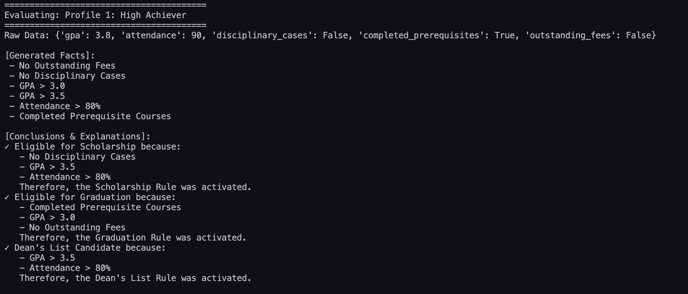
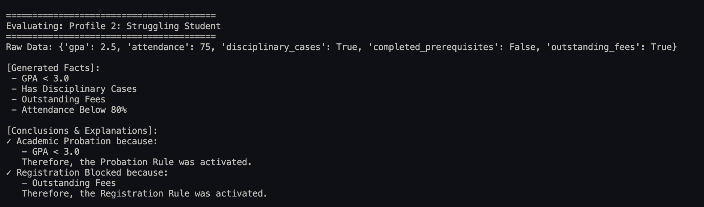
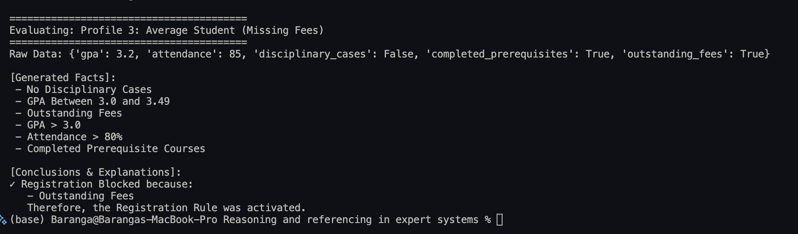

# APT3020 - Reasoning and Inferencing Lab

## Introduction
This repository contains an implementation of a Knowledge-Based Expert System designed to act as an Intelligent Academic Advisor. It evaluates student performance, attendance, and administrative standing to output academic recommendations.

## Problem Statement
The university requires an automated system capable of analyzing student metrics (GPA, attendance, disciplinary records, and financial standing) to recommend specific academic outcomes such as scholarships, probations, or graduation eligibility.

## Knowledge Base
The knowledge base is entirely decoupled from the application logic and is formatted in JSON (`knowledge_base.json`). 

**Implemented Rules:**
1. **Scholarship Rule:** IF GPA > 3.5 AND Attendance > 80% AND No Disciplinary Cases THEN Eligible for Scholarship
2. **Graduation Rule:** IF GPA > 3.0 AND Completed Prerequisite Courses AND No Outstanding Fees THEN Eligible for Graduation
3. **Probation Rule:** IF GPA < 3.0 THEN Academic Probation
4. **Registration Rule:** IF Outstanding Fees THEN Registration Blocked
5. **Dean's List Rule:** IF GPA > 3.5 AND Attendance > 80% THEN Dean's List Candidate

## Reasoning Method Used
This system utilizes **Forward Chaining Inference**. 
1. The engine begins with the initial data inputs (Student variables).
2. It translates these variables into discrete boolean facts.
3. It iterates through the rulebase, triggering rules whose antecedents (conditions) are fully satisfied by the known facts.
4. It extracts multiple conclusions without backtracking.
5. An explanation facility maps the matched conditions back to the user to explain *why* a conclusion was reached.

## Screenshots
- 
- 
- 

## How to Run the Program
1. Clone this repository to your local machine.
2. Ensure you have Python 3.x installed. No external packages are required.
3. Run the following command in the terminal from the root directory:
   ```bash
   python reasoning_engine.py